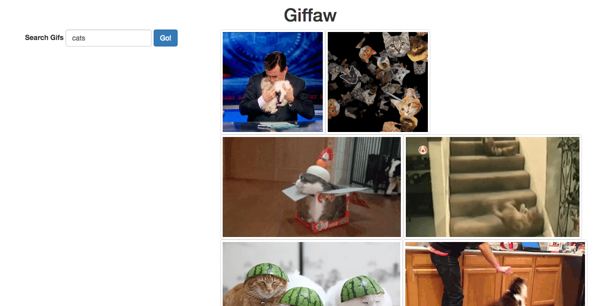

#  APIs Lab

| Title | Type | Duration | Author |
| -- | -- | -- | -- |
| Giffaw | Lab | 2:00 | Sonyl Nagale (adapted from SEI) |


# Giffaw

Your goal is to integrate with the Giphy API.

Recall from the previous lesson how we always need to look at an API's documentation before getting started? Well, [here it is](https://developers.giphy.com/docs/)!

## Basic Requirements:

* A user can see the top 25 GIFs (on page load) for "dogs" (or "cats," or "horses," or "pot-bellied pigs"; you can change this part, we won't judge!).
* A user can search for GIFs using the input field.
* Super bonus: A user can "load more" GIFs.

Your site should look something like:



## Introduction

You're about to write a lot of AJAX-backed JavaScript that will complete our little GIF app.

Make use of the fantastic [Giphy API](http://api.giphy.com/).

Check out its documentation [here](https://developers.giphy.com/docs/).

### Thinking Like an Engineer

As we get into more complicated problems, we need to start thinking increasingly like engineers. Engineers break down large problems into the smallest possible parts and tackle those small parts one at a time.

This is one of the major skills in web development!

Here are some steps to follow to help get you in this mindset:

1. Familiarize yourself with the [docs](https://github.com/Giphy/GiphyAPI).
	- Specifically, we'll be using the [search endpoint](https://github.com/Giphy/GiphyAPI#search-endpoint).
	- Also note the ever-important API key situation (we'll be using the key provided in the `index.html`, although you'll need to insert it into the JavaScript yourself).

1. Test the API out in your browser!
	- Go to http://api.giphy.com/v1/gifs/search?q=cats&api_key=dc6zaTOxFJmzC. This is the API request for the search term `cats`.
	- What do you see? It's a JSON object!

1. Clone this project. We first want to write JavaScript that returns and `console.log()`s that same object we saw when we opened the API in our browser.
	- Look at this example of a `fetch` request:
	
	```js
	fetch("http://api.api.com/search", {
		method: "GET" // Defines what kind of request
	})
	.then(function(response) {
		return response.json()
	})
	.then(onSuccess)
	.catch(onError);

	function onSuccess(json) {
		$("div").append("<h1>" + json.title + "</h1>");
	}

	function onError(error) {
	  alert("Sorry, there was a problem!");
	  console.dir(error);
	}
	```

	- How would you repurpose this to `GET` the data you want from the URL you want?
	- What is your base API URL? What are the query parameters?

1. Start playing in your `scripts/app.js` file.
	- Your first step is to make an AJAX call fire when your page loads. Don't try to do everything at once! First, attempt to log the data to the console. Then, work on logging specific data you want. What do you need to get the GIFs to actually load on the page? There is a bunch of information in this data object, and you must figure out which pieces you need.
	- Once you've narrowed that down, you'll want to build functions that generate HTML strings and append them to the page.
	- First, log those strings to the console and make sure they look like you think they should. Then, append them into the DOM!

## Bonus

1. Want a bonus? Get the input box to make a different AJAX call to the search URL.
	- Does a search box button have a default action? What do we want to do with that?
	- Are we just appending more and more GIFs to the DOM? Do we need to clear previous GIFs before loading more?
	- OMG, are you making a one-page app using AJAX like a boss?

1. Are you feeling up for a super bonus? Add a "Load More" button that, when clicked, appends 25 more GIFs to the bottom of the page.
	- You'll need to make use of the `offset` query parameter.

## All Finished!

Time to kick back!


